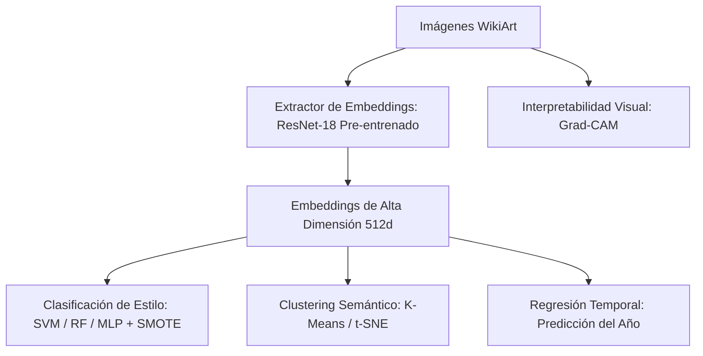

# Plan de Acción — WikiArt Hito 2
**Proyecto de Minería de Datos (CC5205) — Grupo 6, Sección 3**

Este plan de acción detalla la estrategia y los pasos para el desarrollo del **Hito 2: Clasificación, Clustering y Regresión de Pinturas con Deep Learning**. 

---

## 📊 1. Resumen y Hallazgos del Hito 1
En el Hito 1 se sentaron las bases analíticas del dataset (~80,000 obras de WikiArt, 27 géneros) y se entrenaron modelos baseline utilizando metadatos tabulares y características visuales manuales en una muestra de ~3,000 imágenes.

### Resultados Clave:
* **Clasificación (P1):** El baseline con atributos tabulares de geometría rinde muy bajo ($F_1$-score macro = 0.138). Al incorporar variables cromáticas globales (RGB/HSV promedio, contraste, brillo, calidez), el $F_1$-score macro sube a **0.236**. Esto demuestra que el color es una firma clave, pero las estadísticas globales no son suficientes para capturar el trazo, la textura o la iconografía.
* **Clustering (P2):** K-Means con $K=4$ obtuvo un alto coeficiente Silhouette (0.752) porque agrupó por proporciones de lienzo (vertical, horizontal, cuadrado). Sin embargo, los géneros artísticos se distribuyen de manera homogénea entre los clusters, indicando que el formato físico es transversal a los movimientos.
* **Regresión (P3):** Estimar el año de creación logró reducir el Error Absoluto Medio (MAE) de **81.6 años** (baseline) a **67.7 años** gracias al color, sugiriendo que la paleta cromática cambia a lo largo de la historia de manera medible.
* **Interpretabilidad (P4):** Las variables de formato (`aspect_ratio` e `is_portrait`) resultaron ser las más discriminantes de la geometría del lienzo, concordando con géneros históricos (retratos renacentistas verticales vs. paisajes impresionistas horizontales).

---

## 🎯 2. Objetivos Estratégicos del Hito 2
Para superar los límites de las características manuales globales, en el Hito 2 implementaremos representaciones profundas de imágenes mediante **Deep Learning**.

### Objetivos Clave:
1. **Escalar la Muestra:** Aumentar el tamaño del procesamiento de imágenes de 3,000 a 10,000+ o la totalidad de las imágenes disponibles usando extracción por lotes (batch processing).
2. **Embeddings con ResNet-18:** Reemplazar los promedios RGB/HSV por vectores de características semánticas de 512 dimensiones extraídos de la capa penúltima de una red ResNet-18 pre-entrenada en ImageNet.
3. **Optimizar Clasificación y Manejo de Desbalance:** Resolver la mezcla y sesgo de clases dominantes (Impresionismo y Realismo) mediante balanceo de pesos, SMOTE en el espacio latente o submuestreo, buscando aumentar significativamente el $F_1$-score macro.
4. **Clustering sobre Características Semánticas:** Comparar el clustering geométrico del Hito 1 con un clustering basado en la similitud visual latente (embeddings de ResNet) para ver si emergen agrupaciones coherentes con estilos artísticos.
5. **Grad-CAM para Interpretabilidad:** Aplicar mapas de activación de clase ponderados por gradiente (Grad-CAM) para visualizar qué regiones de los lienzos (texturas, formas, pinceladas) hacen que la CNN clasifique una pintura en un estilo determinado.

---

## 🛠️ 3. Pipeline de Implementación Propuesto

### Paso 1: Configuración de PyTorch y GPU
Dado que la extracción de embeddings sobre 10,000+ imágenes es intensiva, es crucial verificar la disponibilidad de CUDA para GPU en el entorno local o Kaggle/Colab.
* Crearemos un script de validación `src/verify_env.py` para asegurar que las dependencias (`torch`, `torchvision`, `Pillow`) estén correctamente instaladas.

### Paso 2: Pipeline de Extracción de Embeddings por Lotes
Implementaremos un script dedicado `src/extract_embeddings.py` para:
1. Definir una clase `WikiArtDataset` (heredando de `torch.utils.data.Dataset`) que cargue las imágenes, aplique transformaciones de redimensionamiento (`224x224`), normalización de ImageNet y manejo de errores (imágenes corruptas).
2. Cargar una red **ResNet-18** pre-entrenada, remover la última capa de clasificación lineal (`fc`), y poner el modelo en modo de evaluación (`eval`) con cálculo de gradientes desactivado (`torch.no_grad()`).
3. Procesar las imágenes en lotes (e.g., `batch_size=64`) usando un `DataLoader` con múltiples subprocesos (`num_workers`).
4. Almacenar los embeddings resultantes en un archivo binario indexado (e.g., `.npy` o un DataFrame serializado en formato `.parquet` o `.pkl`) para evitar re-cálculos costosos.

### Paso 3: Clasificación Avanzada (P1)
En el notebook de trabajo `wikiart_hito2.ipynb` (o scripts modulares en `src/`):
1. Reducir la dimensionalidad de los embeddings de 512 a, por ejemplo, 50-100 componentes usando **PCA** si es necesario acelerar los modelos tradicionales, o entrenar directamente clasificadores eficientes como **SVM Lineal**, **Random Forest** u un clasificador neuronal simple de capas densas (**MLP**).
2. Manejar el desbalance con ponderaciones de clases (`class_weight='balanced'`) o técnicas como **SMOTE** implementadas con la librería `imbalanced-learn`.
3. Reportar matrices de confusión y reportes detallados de clasificación ($F_1$-macro, precisión, recall por género).

### Paso 4: Clustering y Regresión (P2 y P3)
1. **Clustering:** Aplicar K-Means sobre los embeddings y realizar reducción de dimensiones visual con **t-SNE** o **UMAP** coloreando los puntos según su género real. Comparar la métrica Silhouette y la homogeneidad de los clusters resultantes con los del Hito 1.
2. **Regresión:** Entrenar un regresor (Random Forest Regressor o Ridge Regression sobre embeddings) para predecir el año de las pinturas y comparar el MAE contra el del Hito 1.

### Paso 5: Grad-CAM e Interpretabilidad (P4)
1. Seleccionar algunas pinturas emblemáticas de diferentes géneros (ej. Impresionismo, Cubismo, Renacimiento).
2. Implementar un módulo Grad-CAM utilizando la última capa convolucional de la ResNet.
3. Guardar y visualizar los mapas térmicos superpuestos en las pinturas originales para el informe de resultados.

---

## 📈 4. Cronograma Sugerido para las Próximas Sesiones

* [ ] **Sesión 1: Infraestructura y Extracción**
  * Verificar accesibilidad al conjunto completo de imágenes de WikiArt.
  * Escribir el pipeline de extracción de embeddings `src/extract_embeddings.py`.
  * Extraer y guardar embeddings para una muestra de 10,000 imágenes o la totalidad.
* [ ] **Sesión 2: Modelamiento Hito 2**
  * Entrenar modelos de clasificación usando embeddings vs. baselines del Hito 1.
  * Implementar el pipeline de clustering latente y visualización t-SNE/UMAP.
  * Ejecutar el modelo de regresión temporal y analizar el nuevo error MAE.
* [ ] **Sesión 3: Interpretabilidad y Documentación**
  * Escribir el script de Grad-CAM y generar las visualizaciones para pinturas de prueba.
  * Redactar y actualizar el notebook con análisis detallado de curvas de aprendizaje, matrices de confusión y análisis cualitativo.
  * Preparar el informe final del Hito 2 en HTML/PDF y actualizar diapositivas de defensa.

> [!NOTE]
> Para el procesamiento de imágenes, si los archivos de imagen no están localmente en el directorio de trabajo (el notebook del Hito 1 referenciaba `/home/felipe/Documentos/Mineria/archive`), necesitaremos validar la ubicación física del dataset en esta máquina o facilitar un script para descargarlos/vincularlos adecuadamente.

---

### ¿Cómo procedemos?
* **Opción A:** Empezar creando los scripts de infraestructura en `src/` para la validación del entorno y la extracción de embeddings utilizando PyTorch.
* **Opción B:** Copiar y portar el notebook `wikiart_hito1.ipynb` a un nuevo archivo `wikiart_hito2.ipynb` para estructurar la nueva experimentación directamente.
* **Opción C:** Si el usuario tiene dudas o comentarios sobre el enfoque, podemos ajustar el plan.
